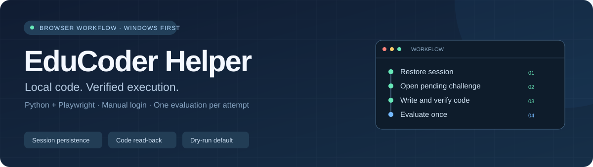

<p align="center">
  
</p>

<p align="center">
  <a href="https://github.com/Zyandiel/EduCoder-AutoSubmit/actions/workflows/tests.yml"></a>
  
  
  <a href="LICENSE"></a>
</p>

<p align="center">
  <b>将本地 C++ 代码带入 EduCoder，自动完成填写、回读校验与评测。</b><br>
  Python + Playwright · 手动登录 · 多文件关卡 · 默认 dry-run
</p>

<p align="center">
  <a href="#快速开始">快速开始</a> · <a href="docs/usage.md">使用指南</a> · <a href="docs/troubleshooting.md">常见问题</a> · <a href="CONTRIBUTING.md">参与贡献</a>
</p>

## 它能做什么

EduCoder Helper 适合已经准备好本地解答、需要在头歌平台逐关填写和评测的用户。程序通过正常浏览器操作完成重复步骤，保留代码备份和结果。

| 能力 | 当前支持 |
| --- | --- |
| 手动登录与会话恢复 | Cookie、localStorage、IndexedDB 保存与恢复 |
| 作业与关卡读取 | 作业名称、进度、实际详情链接、关卡状态 |
| 本地代码填写 | `N.cpp`、多文件映射、原代码备份、逐字回读校验 |
| 自动逐关评测 | 跳过已通过关卡，每关单次评测；失败记录后继续其他作业 |
| Windows 一键入口 | 环境检查、初始配置、运行锁、结果汇总 |
| 最终提交作业 | **暂未开放**；`submit` 返回退出码 2 |

> **dry-run 仍会修改在线代码并运行评测，平台可能同步更新进度和成绩。** 它限制的是最终“提交作业”，不是只读预览。当前支持已核实的 Monaco 页面结构；其他编辑器和站点改版需要适配。

## 快速开始

需要 **Windows、Python 3.11+、Google Chrome**，以及你有权访问的 EduCoder 课程。也可在配置中选择 Edge 或 Playwright Chromium。

### 1. 获取项目

```powershell
git clone https://github.com/Zyandiel/EduCoder-AutoSubmit.git
cd EduCoder-AutoSubmit
```

也可使用仓库的 **Code → Download ZIP**，解压后打开文件夹。

### 2. 创建配置

首次双击 **START.cmd**：检查 Python、准备依赖，生成 `config.local.yaml` 后退出。打开配置，替换课程地址，填写 `list` 中的完整作业名称并启用：

```yaml
course_url: "https://www.educoder.net/classrooms/YOUR_COURSE_ID/shixun_homework"
dry_run: true
browser_channel: chrome
assignments:
  - name: "你的实训名称"
    enabled: true
```

完整模板见 [config.example.yaml](config.example.yaml)。本地配置默认被 Git 忽略；旧版 `config.yaml` 仍可使用。

### 3. 准备代码

```text
solutions/
└── 你的实训名称/
    ├── 1.cpp
    ├── 2.cpp
    └── 3.cpp
```

第 N 关读取 `N.cpp`，代码应满足题目模板要求，可能是完整程序、函数实现或头文件。[示例目录](examples/solutions/)展示单文件和多文件布局；示例代码不是课程答案。

### 4. 登录并运行

双击 **LOGIN.cmd**，在浏览器中手动登录、完成验证，在终端输入 `save` 保存会话。然后可以读取作业名称：

```powershell
.\.venv\Scripts\python.exe main.py list
```

完成作业配置和代码准备后，再次双击 **START.cmd**。它刷新列表、处理启用且未完成的作业，并写入结果汇总。

运行期间请避免编辑自动化浏览器或使用系统剪贴板；代码写入会临时使用剪贴板，结束后恢复原文本。

## 命令一览

在项目目录执行；以下 `python` 代表 `.\.venv\Scripts\python.exe`。

| 命令 | 作用 |
| --- | --- |
| `python main.py init` | 创建本地配置，保留已有文件 |
| `python main.py login --fresh` | 手动重新登录并保存会话 |
| `python main.py list` | 列出课程作业与进度 |
| `python main.py auto --check` | 检查启用配置及现有本地代码，不打开浏览器 |
| `python main.py auto` | 恢复登录、刷新列表、自动填写和评测 |
| `python main.py run --assignment "实训名称" --dry-run` | 运行指定实训；需要先读取 `list` |
| `python main.py inspect --assignment "实训名称" --enter` | 读取关卡并进入工作区，保存诊断 |

高级配置、多文件映射、日志字段和退出码见 [使用指南](docs/usage.md)。

## 项目结构

```text
browser/       浏览器会话与页面导航
educoder/      作业、关卡、编辑器、评测与流程
tests/         单元测试及本地浏览器页面测试
examples/      可复制的目录和文件映射示例
docs/          使用说明、故障排查与开发文档
scripts/       浏览器诊断工具
solutions/     用户本地代码（被 Git 忽略）
logs/          操作结果及代码备份（被 Git 忽略）
```

## 开发与贡献

GitHub Actions 在 Windows 和 Linux 上运行本地浏览器测试，不使用真实账号或访问课程。Linux 测试用于检查代码和页面适配；桌面工作流以 Windows 为主要支持平台。

```powershell
python -m pip install -r requirements.txt
python -m playwright install chromium
python -m unittest discover -s tests -v
```

欢迎通过 [Issue](https://github.com/Zyandiel/EduCoder-AutoSubmit/issues) 报告问题或提交 PR。请先阅读 [贡献指南](CONTRIBUTING.md)和 [安全说明](SECURITY.md)。

本项目不提供答案生成服务，不随仓库分发真实课程解答。它与 EduCoder 官方无关联；仅在你有权限的页面使用，验证码和访问验证由用户完成。

以 [MIT License](LICENSE) 发布。
