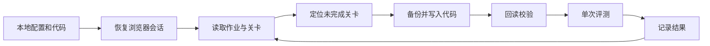

# 开发与验证

## 本地测试

```powershell
python -m pip install -r requirements.txt
python -m playwright install chromium
python -m unittest discover -s tests -v
```

使用 Chrome 时设置 `$env:EDUCODER_TEST_BROWSER='chrome'`。默认使用 Playwright Chromium。Linux CI 安装浏览器使用 `python -m playwright install --with-deps chromium`。

测试使用本地页面、拦截请求和临时配置验证会话、分页、弹窗、关卡匹配、评测结果新鲜度、代码映射及运行保护。不使用真实账号或课程答案。

CI 配置为 Windows / Python 3.11、Windows / Python 3.14 和 Ubuntu / Python 3.12。这是离线页面及环境检查，不代表在每次 CI 中实测线上课程。桌面工作流以 Windows 为主要支持平台。

## 数据流



- `browser/session.py` 管理上下文与原子保存会话。
- `educoder/assignments.py` 正常操作页面收集列表和详情链接。
- `educoder/challenges.py` 校验表格与工作区一致，用可见链接导航。
- `educoder/editor.py` 处理已验证的 Monaco 写入与回读。
- `educoder/solution_files.py` 在网页修改前检查文件映射。
- `educoder/evaluator.py` 只接受本次点击后更新的结果。
- `educoder/runner.py` 负责逐关备份、评测与异常隔离。
- `educoder/auto.py` 增加登录入口、列表刷新、检查和运行锁。

新增 selector 前核实 DOM 并建立匿名页面测试。未知状态不按通过处理。不能确定关卡、在线文件或结果归属时保守报错，不默认增加重试评测或最终提交。

配置初始化后，`python scripts/check_browser.py` 访问一次公开首页并保存诊断，不在 CI 中执行。

官方参考：[Playwright Python CI](https://playwright.dev/python/docs/ci)、[GitHub checkout](https://github.com/actions/checkout)、[GitHub setup-python](https://github.com/actions/setup-python)。
